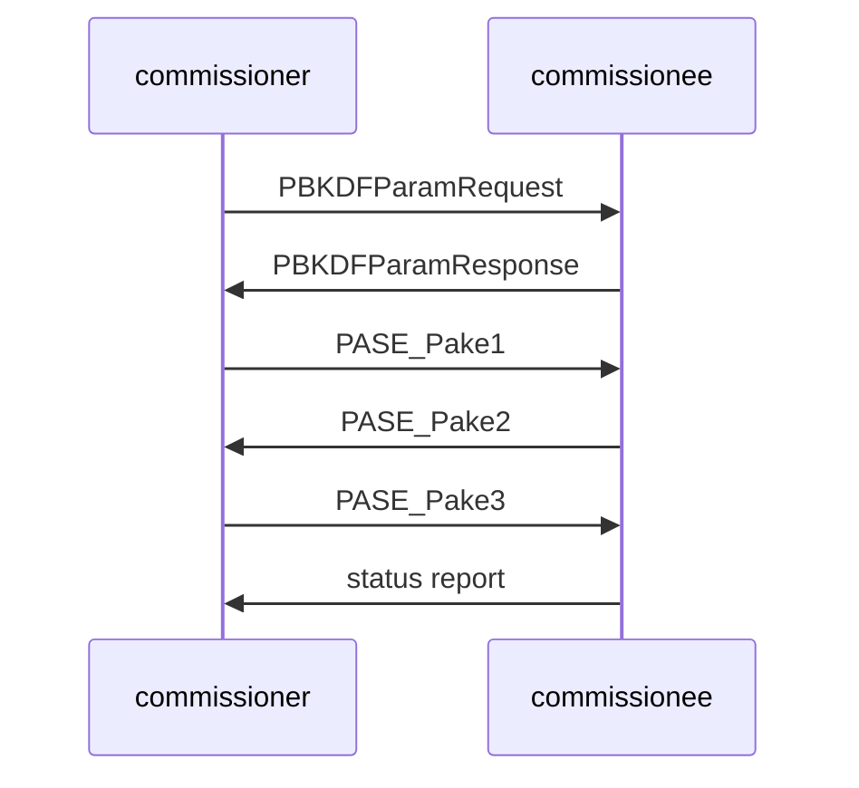
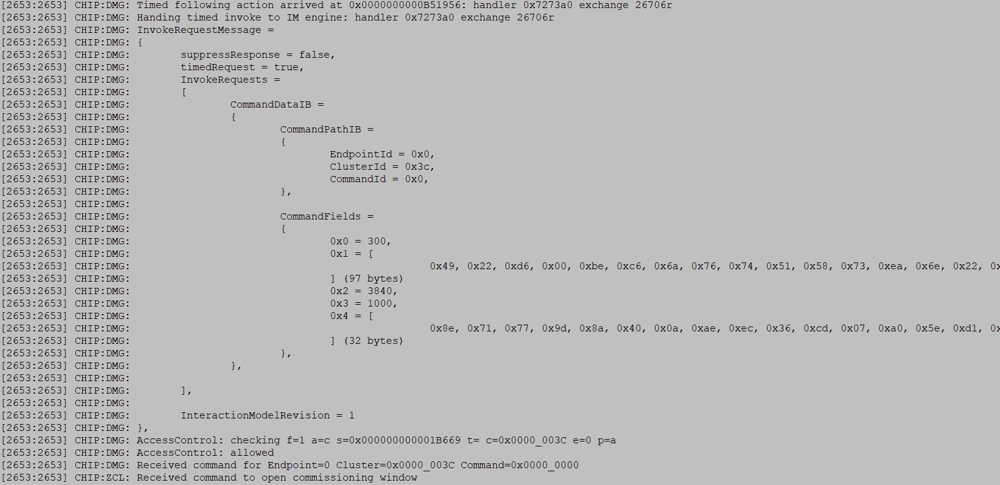

# Matter 设备配网流程 ---- 配网材料和 SPAKE2P 机制

## 1. Matter 配网材料

Matter 配网（commissioning）使用 SPAKE2P 协议完成 PASE，进而验证 DAC（Device Attestation Credentials），派发 NOC，然后就可以使用 NOC 完成 CASE，在 CASE 上安全地交互控制、查询等命令。

- SPAKE2P 协议交互需要设备端提供 Spake2pIterationCount，Spake2pSalt，Spake2pVerifier，Passcode。
  
  - Spake2pIterationCount （下文简称 Iterations）的范围是 1000 ~10000。
  
  - Spake2pSalt （下文简称 Salt）是 16 ~ 32 bytes 的随机数。
  
  - Spake2pVerifier （下文简称 Verifier）是由 SPAKE2P 中的 W0 和 L 拼接而成的数据，L 是由 SPAKE2P 的 W1 和 P 计算得来的，固定 97 bytes。
  
  - passcode 是一个 27 bit 的数值，范围从 0x0000001 to 0x5F5E0FE (即 十进制的 00000001 to 99999998 ）,并且不能是以下这些无效值: `00000000`, `11111111`, `22222222`, `33333333`, `44444444`, `55555555`, `66666666`, `77777777`, `88888888`, `99999999`, `12345678`, `87654321`。

- DAC 验证流程需要设备端提供 DeviceAttestationCert，DeviceAttestationKey，ProductAttestationIntermediateCert（PAI），CertificationDeclaration（CD）。

- 另外，为了优化服务发现的性能，一般设备端还会提供 Discriminator（12bit value）。
  *注：这里的设备端指的是commissionee 角色的物理设备，下文也是如此。*

## 2. Matter 配网流程中的 PASE

**配网的成功的前提是 commissioner 已经通过 out-of-band 方式获取动了 passcode。**

### 2.1 Matter设备首次配网过程中的 PASE 流程

 大致流程如下图：

1. commissioner 发送 PBKDFParamRequest，commissionee 响应 PBKDFParamResponse，这样 commissioner  获取到 spake2p 的 iteration 和 salt。

2. commissioner 基于 passocde 、Iterations、Salt 以及 EC 参数中随机选取的 p，计算得出自身的 w0 和 w1，将 w0 和 w1 转换并打包成 pA，在 PASE_Pake1 中发送给commissionee 。

3. commissionee 也基于 passocde 、Iterations、salt 以及 EC 参数中随机选取的 p，计算得出自身的 w0 、w1和 L（当然可以直接从 pakeVerifier 获取 w0 和 L，对于设备端，目前的代码实现是直接从pakeVerifier 获取 w0 和 L），将 w0 和 L 转换并打包成 pB。同时，基于pA、pB 计算得到 TT，再由 TT 计算得到 cB。 在 PASE_Pake2 中将 pB 和 cB 发送 commissioner 。
   注：双方基于pA、pB 计算得到各自的 TT，再从 TT 得到 cA，cB，Ke。

4. commissioner 也根据 pA、pB 得出  cA，cB，Ke，比对 PASE_Pake2 收到的 cB 和计算得到的 cB，如果一致，验证成功。同时将 cA 在  PASE_Pake3 发送给 commissionee 。

5. commissionee 比对 PASE_Pake3 收到的 cA 和 自身计算得到的 cA，如果一致，验证成功，不一致就是失败，并将结果通过 status report  报文发送给 commissioner 。

6. 在验证成功的情况下，双方根据 Ke 计算得到 I2RKey 和 R2IKey，这是 PASE session 上报文加解密的 key，至此，PASE 完成。

运行日志如下图：

### 2.2 Mult-Fabirc 的非首次配网过程中的 PASE 流程

Matter 支持将设备同时加入不同的 Fabric。当设备已经配网，想要将它同时加入其它 Fabric，需要原来 commissioner 的同意和支持。原 commissioner 需要发送 Verifier，Discriminator，Iterations，salt 给设备，并通知设备开启 commission window（这些操作是基于 CASE 的）。同时将 passcode 以 out-of-band 的方式提供给新的 commissioner。注意，passcode 不会通过网络方式传输给 commissionee 以强化安全。设备基于接收到的这套 Verifier，discriminator，Iterations，Salt 执行配网操作加入新的 Fabric。

开启配网窗口命令是 Administrator Commissioning Cluster （0x003C）的 OpenCommissioningWindow 命令，该命令有5个参数：CommissioningTimeout，Verifier，Discriminator，Iterations，Salt。设备端运行日志如下图：

passcode 或者 QR code 是由 commissioner 提供，运行日志如下图：

## 3. 为什么 commissionee 设备内部同时保存 pakeVerifier 和 passcode 呢？

有2个方面的原因：

1. 设备生产时，需要打印 passcode 和 QR code 到设备上，并且每个设备都不同。在实际产线流程中，从设备读取 passcode 后生成QR code 并打印相关标签是合理简单的操作方式。而 passcode 无法 pakeVerifier 推导出来是保存 passcode 的原因。

2. 多少情况下，Matter 设备都是资源严重受限的嵌入式设备，从 passcode 计算 pakeVerifier 是个耗资源的操作，所以预置 pakeVerifier 可以优化配网性能。而 PASE 只在配网时用到，所以安全风险很小。

## 4. pakeVerifier 生成工具

Iterations，Salt，Verifier，Passcode 是一组强关联的数据，需要绑定使用才有效。为了保证安全性，还需要让 passcode、Salt 尽量随机化。通过 Matter 提供的 spake2p 工具 (代码位于 src/tools/spake2p ) 来生成这组数据，比如给定  Iterations、Salt 生成 Verifier，也可以让工具一次性生成多组随机  Iterations、Salt 以及相应的 Verifier，该工具可以将生成的数据输出到 CSV 文件。
